# FPGA Design Visualization and Analysis

This tool provides a comprehensive way to visualize and analyze FPGA designs using Quartus Prime. It offers insights into various aspects of your project, such as RTL implementation, state machines, logic cells, and resource utilization. Follow the steps below to effectively utilize this tool.

## Table of Contents

1. [RTL Viewer](#rtl-viewer)
2. [State Machine Visualization](#state-machine-visualization)
3. [Detailed Schematic View](#detailed-schematic-view)
4. [Path Tracing](#path-tracing)
5. [Primitive Block Navigation](#primitive-block-navigation)
6. [Register Connections](#register-connections)
7. [Combinational Logic Analysis](#combinational-logic-analysis)
8. [State Variables as Registers](#state-variables-as-registers)
9. [Logic Cell to Flip-Flop Properties](#logic-cell-to-flip-flop-properties)
10. [AND Gate Example](#and-gate-example)
11. [Fitter Summary](#fitter-summary)
12. [Fitter Settings](#fitter-settings)
13. [Resource Usage Summary](#resource-usage-summary)
14. [Pin Configuration](#pin-configuration)
15. [PLL Configuration](#pll-configuration)
16. [Resource Utilization by Entity](#resource-utilization-by-entity)
17. [Control Signals](#control-signals)
18. [Global and Fast Signals](#global-and-fast-signals)
19. [Contributing](#contributing)
20. [License](#license)

## RTL Viewer

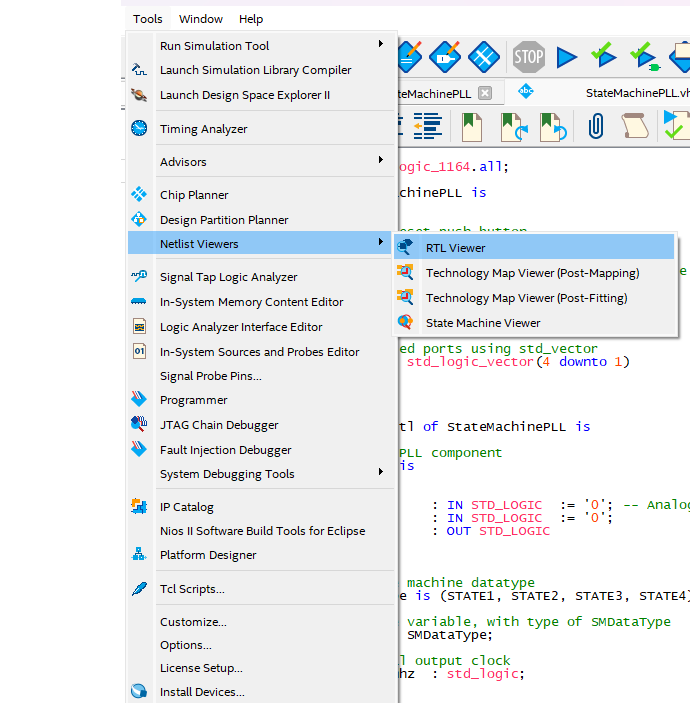

- The RTL viewer provides a high-level block diagram of the VHDL code implementation.
- Inputs are typically on the left, and outputs are on the right.
- Observe registers (~reg) before the output (Q pinoyt).
- Ports inside the `vhdl process(clk)` are considered flip-flops.
- The diagram features a PLL block with inputs `rst`, `clk`, and an output `clk`.

## State Machine Visualization

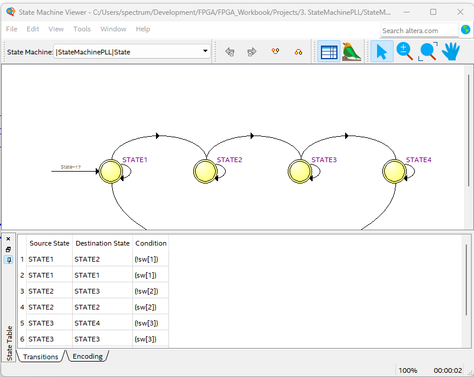

- Clicking on the State object recognizes it as a state machine.
- Follow state transitions to ensure your state diagram is correct.

## Detailed Schematic View

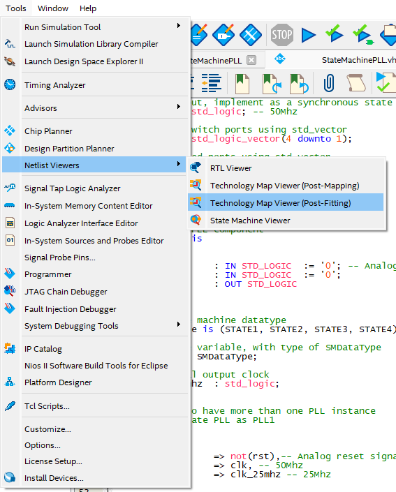

- Open the detailed schematic view for intricate design analysis.

## Path Tracing

- Trace signal paths by referring to 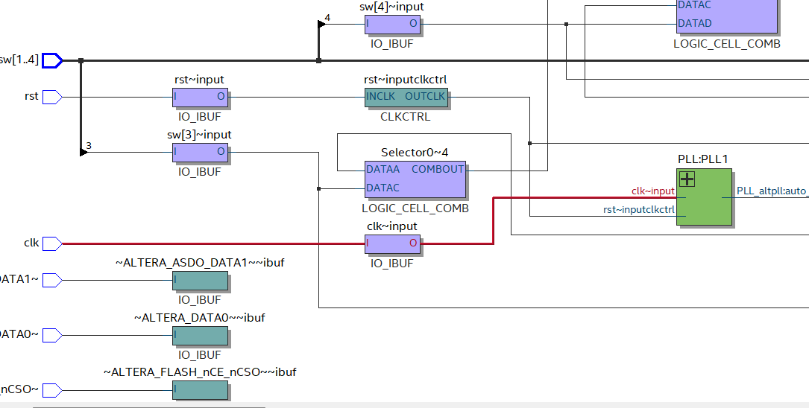 and 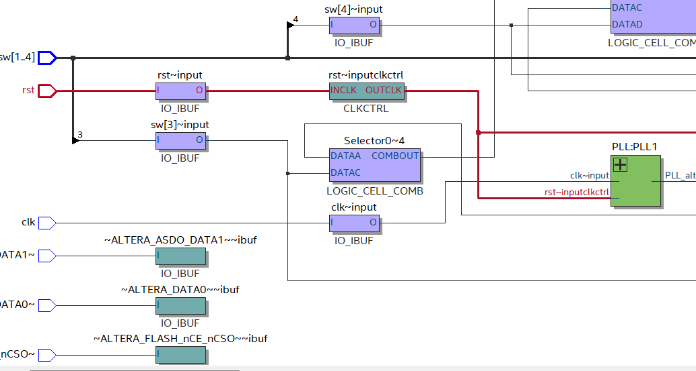 images.

## Primitive Block Navigation

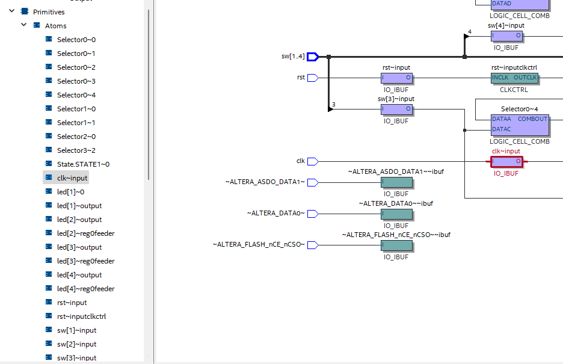

- Navigate primitive blocks using the left-side netlist navigator.

## Register Connections

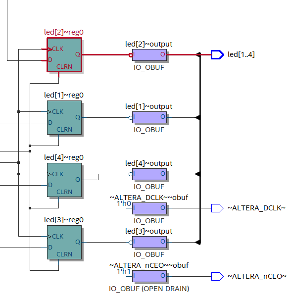

- Registers do not directly drive LEDs; IO_BUFFER is used in between.

## Combinational Logic Analysis

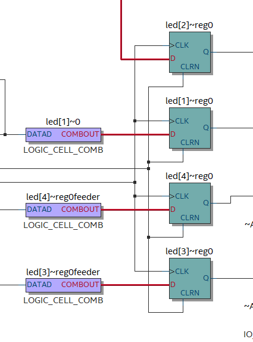

- Observe D-input to registers driven by combinational logic cells.

## State Variables as Registers

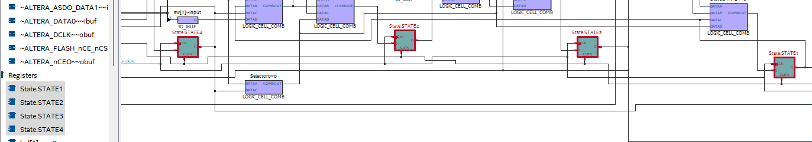

- State variables like `STATE1`, `STATE2`, etc., are treated as registers.

## Logic Cell to Flip-Flop Properties

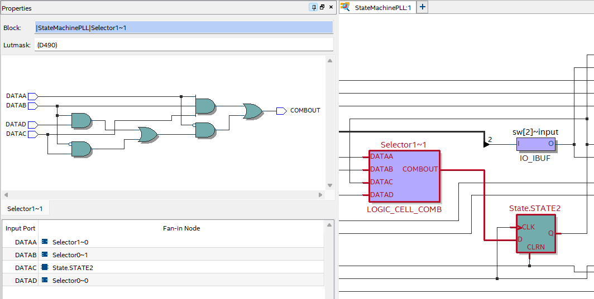

- Examine properties of the combination cell with 4 inputs (`DATA A`, `B`, `C`, `D`) and a `COMB` output.

## AND Gate Example

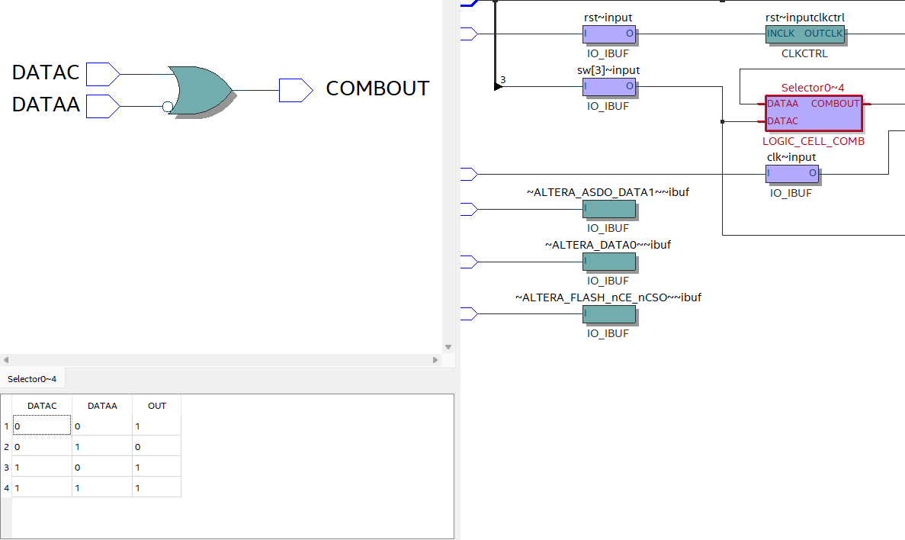

- Example of an AND gate using `LOGIC_CELL_COMB`.

## Fitter Summary

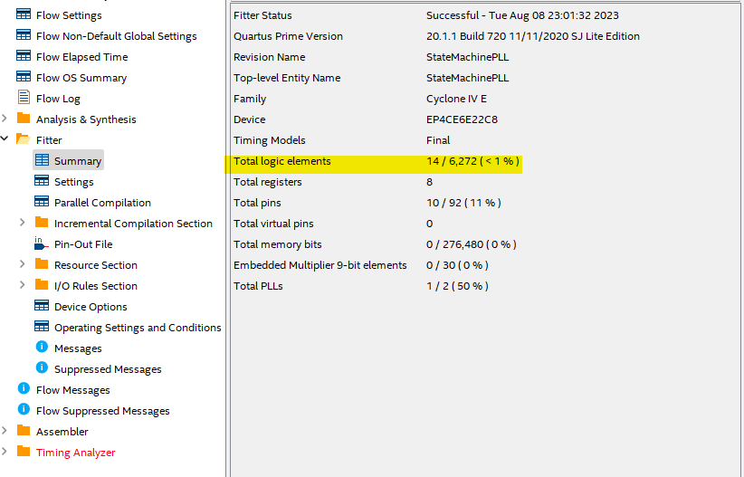

- Review logic elements, registers, pins, memory bits, and PLL utilization.

## Fitter Settings

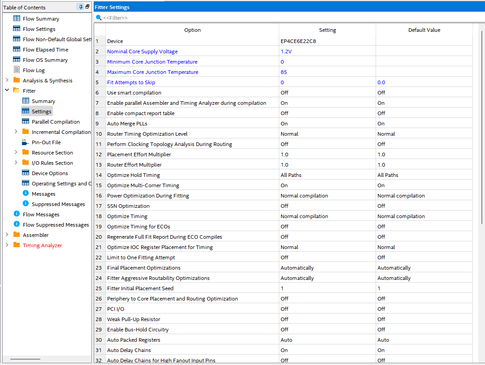

- View default and actual settings in Fitter.

## Resource Usage Summary

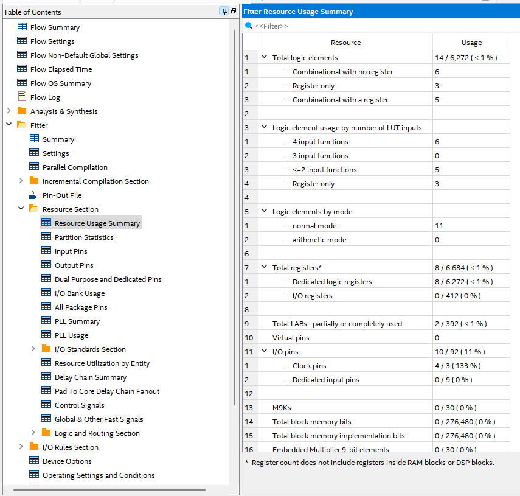

- Summarized view of resource utilization, including CLBs.

## Pin Configuration

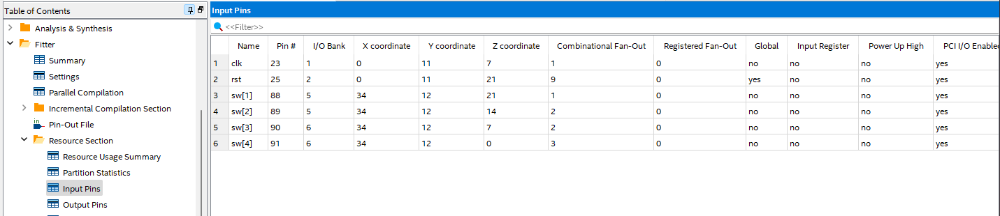

- Explore input and output configurations.

## PLL Configuration

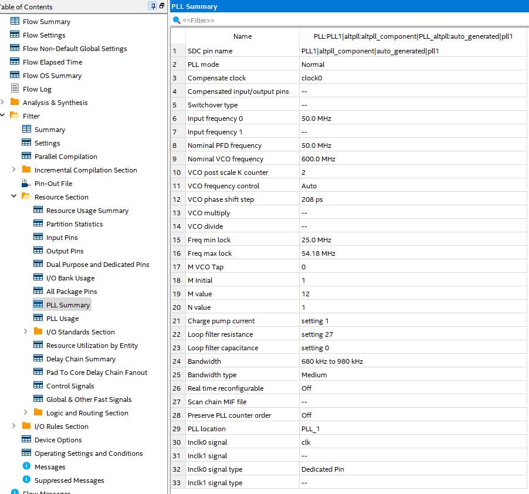

- Understand PLL configuration.

## Resource Utilization by Entity

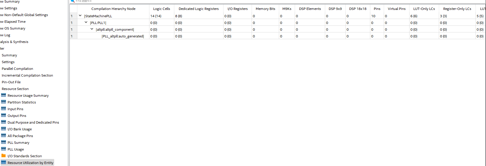

- Breakdown of resources used by each entity.

## Control Signals

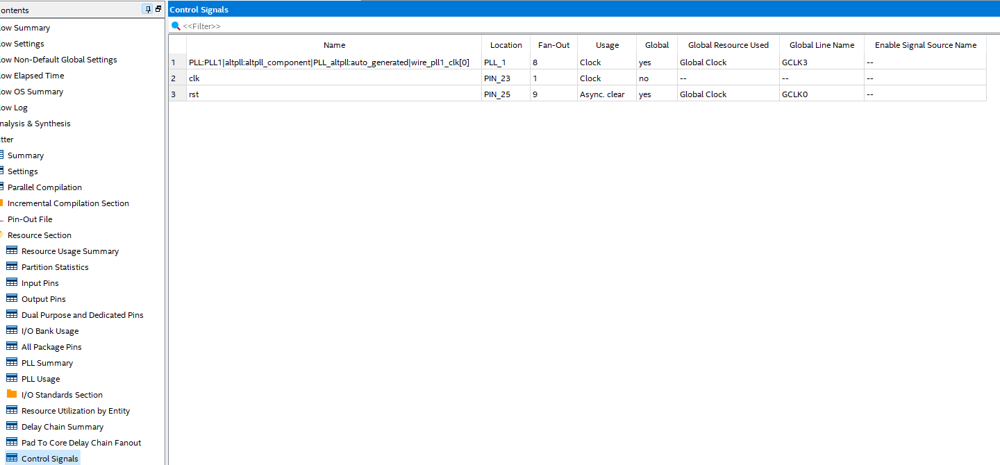

- Signals controlling registers in your design (e.g., clk, rst).

## Global and Fast Signals

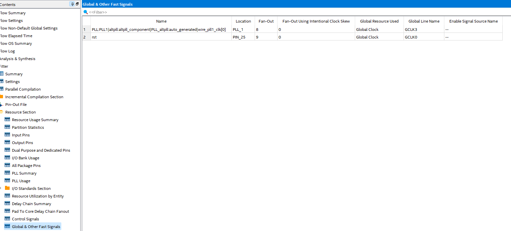

- Exploration of global and fast signals.
