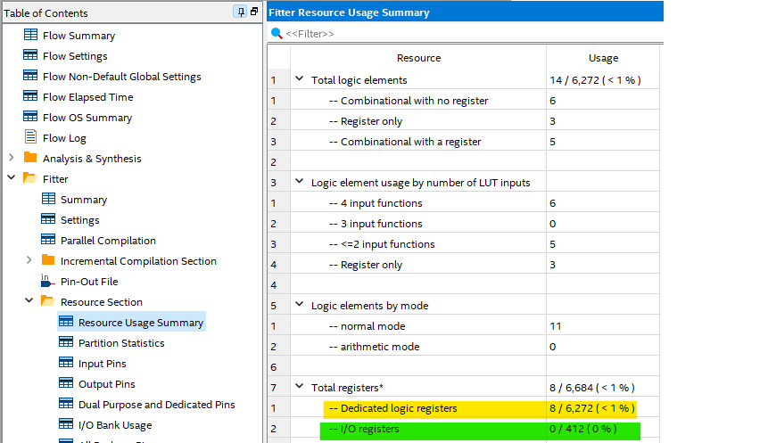
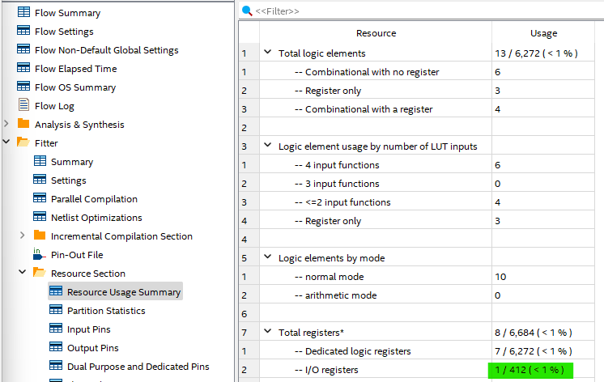
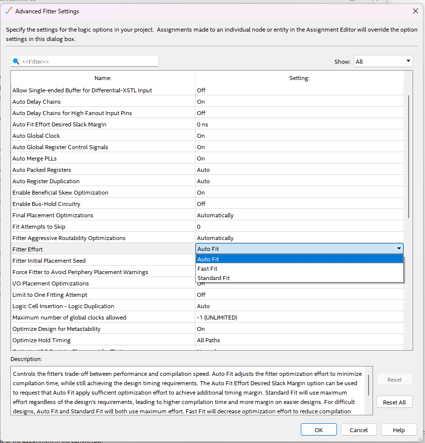

# FPGA Design Optimization Guide

Welcome to the FPGA Design Optimization Guide! This guide aims to assist you in optimizing your FPGA design using Quartus Prime. By following the steps outlined below and leveraging the provided images, you can enhance your project's performance and resource utilization.

## 1. Open Assignment Editor

Here you can see different pinout configurations. In the right drop-down menu, you can explore various categories related to pin assignments.

## 2. Logic Registers Placement

Example of how you can move dedicated logic registers close to I/O pins to enhance design performance:

From this picture, you can see that dedicated logic registers use 8 / 6,272 ( < 1 % ) of the core FPGA block. Our goal is to bring it closer to I/O registers.

## 3. IO Timing Configuration - Node Finder

You can use the Node Finder to locate objects in your design. For example, you can select `led[1]~reg0` and add it by pressing OK.

## 4. IO Timing Configuration

In IO Timing editor, configure the port you've selected as follows:

Assignment name = Fast output register (Registers will be as close as possible to IO pins)
Value = On (Will perform optimization and place registers inside IO cells)

## 5. Global Clock Signal

Create a new Global clock signal as shown below:

## 6. Project Compilation

Compile your project to apply the configured settings and optimizations.

## 7. Verify Output Pin Configuration

Verify that the output pin you've previously selected uses an output register. You should see Output register = yes.

## 8. Resource Usage Summary

Check the resource usage summary again:

Now you should see that the amount of IO registers has changed. This means the configuration was successful:
- Dedicated logic registers = 7 / 6,272 ( < 1 % )
- I/O registers = 1 / 412 ( < 1 % )

## 9. Project Settings

### Compiler Options

You can check compiler options and optimization mode for your design as shown below:

### Advanced Synthesis Settings

You can set how you want to encode the State Machine. The "auto" option allows Quartus to make the decision:

### Advanced Fitter Settings

From the picture below, you can set different compilation strategies. You can opt for either a fast or a normal time compilation. Additionally, you can change the fitter's initial placement seed from 1 to a higher value if you encounter slight timing delay issues in your design.

### Weak Pull-Up Resistor

The weak pull-up resistor setting can be applied to all inputs and outputs across your entire design. You can turn it on or off as needed.

## Conclusion

By following these optimization steps and adjusting your project settings, you can significantly improve your FPGA design's performance, resource utilization, and overall efficiency. Happy designing!
