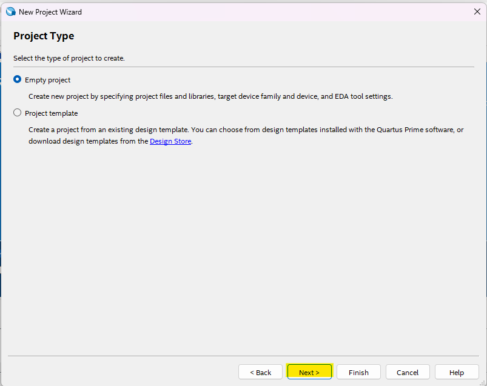

# VHDL Project Setup Guide

This guide will walk you through the steps to set up a VHDL project using Quartus Prime for programming an FPGA device. Please follow the steps below, and refer to the corresponding images in the "img" directory for visual reference.

### Step 1: File -> New Project Wizard

### Step 2: Next

### Step 3: Select Project Directory and Name Your Project

### Step 4: Create Empty Project

### Step 5: Add Additional Files (if needed)

### Step 6: Select Your Chip (EP4CE6E22C8 in My Case)

### Step 7: Finish

## Create VHDL File

### Step 8: New

### Step 9: New VHDL File

### Step 10: Save As Under `ProjectFolder`/src

### Step 11: Compile Code

### Step 12: Code Compiled

### Step 13: Press Programming Tool

### Step 14: Program Your Device

Congratulations! You have successfully set up your VHDL project and programmed your FPGA device. If you encounter any issues during the process, please refer to the images and steps above for assistance. Happy coding!