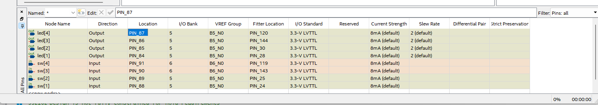
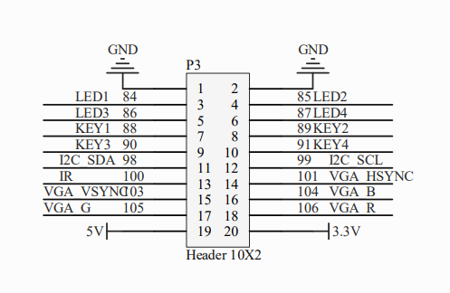

# SequentialButtonLEDControl Project

This repository contains a simple hardware design project called "SequentialButtonLEDControl" written in VHDL. The project targets a hardware platform (e.g., an FPGA) with four input switches and four output LEDs. The code is designed to control the LEDs based on the state of the input switches in a sequential manner.

## Pictures

### Pin Assignments



This image displays the pin assignments used in the Quartus environment. It shows how the input switches (`sw`) and output LEDs (`led`) are connected to the specific pins of the target hardware device.

### Board Pinout



This image represents the pinout diagram of the evaluation (EVK) board used for testing the "SequentialButtonLEDControl" project. It indicates the physical locations of the input switches and output LEDs on the board.

## Code Explanation

The VHDL code in "SequentialButtonLEDControl.vhd" describes the hardware behavior to control the LEDs based on the input switches. The entity declaration defines two ports: `sw` (input switches) and `led` (output LEDs). The `sw` port is a 4-bit vector, representing four individual input switches, and the `led` port is also a 4-bit vector, representing four individual output LEDs.

```vhdl
library ieee;
use ieee.std_logic_1164.all;

entity SequentialButtonLEDControl is
port
(
    sw  : in std_logic_vector(4 downto 1);
    led : out std_logic_vector(4 downto 1)
);
end entity;
```

The architecture `rtl` specifies the behavior of the entity. In this code, it performs a simple assignment of the input switch values to the corresponding LED outputs. Each LED output is directly connected to one of the input switches.

```vhdl
architecture rtl of SequentialButtonLEDControl is
begin
    led(1) <= sw(1);
    led(2) <= sw(2);
    led(3) <= sw(3);
    led(4) <= sw(4);
end architecture;
```

The code's functionality can be summarized as follows:
- Whenever the value of an input switch (`sw`) changes (e.g., a button is pressed or released), the corresponding LED (`led`) will immediately reflect the new state of the switch.
- For example, if `sw(1)` is set to '1' (logic high), then `led(1)` will also be set to '1', and similarly for the other switches and LEDs.

It's important to note that this is a simple demonstration of a sequential control mechanism for LEDs using input switches. Depending on the target hardware and requirements, more complex and interactive behaviors can be implemented.

To use this code, you would typically synthesize and implement it on an FPGA or other programmable hardware devices using a design tool like Quartus (as indicated by the pin assignments image). Ensure that the pin assignments are correctly mapped according to the board pinout (as shown in the board pinout image) to ensure proper functionality.