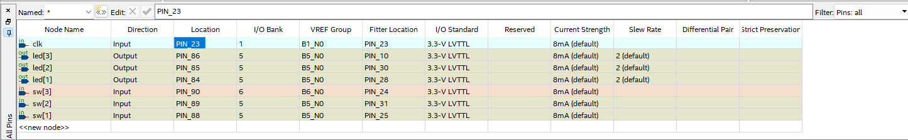
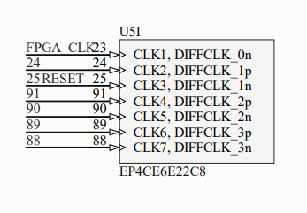

# StateMachine Project

This repository contains a VHDL code implementation of a simple state machine that controls LEDs based on the state of input switches. The state machine is designed to run synchronously with a clock signal. This README provides an overview of the code's functionality and how to use it.

## Code Overview

The `StateMachine` entity has the following ports:

- `clk`: The clock input signal used to synchronize the state machine.
- `sw`: A 4-bit vector representing input switches.
- `led`: A 4-bit vector controlling output LEDs.

The state machine has four states: `STATE1`, `STATE2`, `STATE3`, and `STATE4`. It cycles through these states based on the input switch conditions. The LED outputs are controlled according to the active state.

## Code Implementation

The VHDL code includes a synchronous process that operates on the rising edge of the clock signal. The process uses a case statement to define the behavior of the state machine based on the current state. The LEDs are updated based on the state and input switch conditions.

## Images

### Pin Assignments

This image depicts the FPGA IO pin assignments used in the design. It showcases how the input switches and output LEDs are mapped to specific FPGA pins.

### FPGA Clock Signals

This image illustrates the available clock pins on the FPGA board. It showcases the possible connections for the clock input (`clk`) used by the state machine.

## Usage

Running the Project with Quartus Prime
To run this VHDL project using Quartus Prime without creating a new project:

1. Open Quartus Prime.
2. Open the existing project that contains the `StateMachine` VHDL code.
3. Ensure that the appropriate FPGA target and clock settings are configured within the project.
4. Compile and synthesize the design using Quartus Prime.
5. Program the compiled design onto your FPGA board.
6. Remember to adapt the code to your specific FPGA target and clock frequency requirements.

Feel free to modify and enhance the code to fit your needs or integrate it into a larger project.