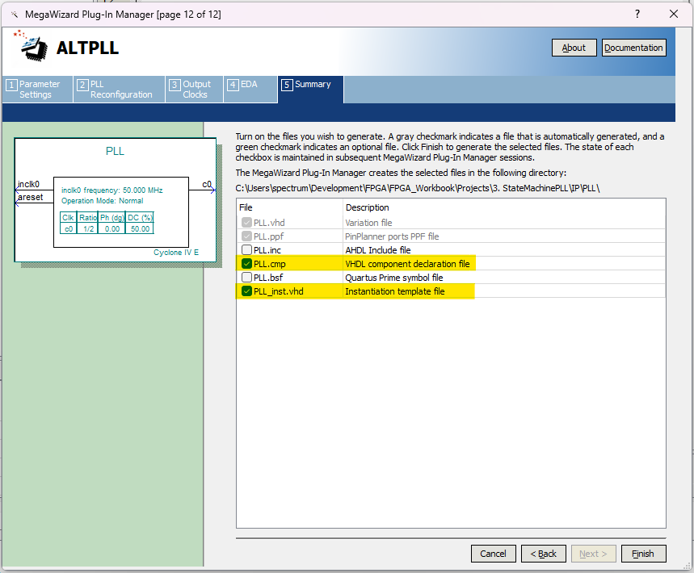

# StateMachinePLL Project

This repository contains a VHDL code implementation of a state machine that controls LEDs based on the state of input switches. The state machine is designed to run synchronously with a clock signal and utilizes a PLL (Phase-Locked Loop) to generate a 25 MHz clock from a 50 MHz input clock. This README provides an overview of the code's functionality, how to use it with Quartus Prime, and includes step-by-step instructions.

## Code Overview

The `StateMachinePLL` entity has the following ports:

- `rst`: Reset input signal.
- `clk`: A 50 MHz clock input.
- `sw`: A 4-bit vector representing input switches.
- `led`: A 4-bit vector controlling output LEDs.

The state machine has four states: `STATE1`, `STATE2`, `STATE3`, and `STATE4`. It cycles through these states based on the input switch conditions. The LED outputs are controlled according to the active state.

## PLL Implementation

The code includes a PLL instantiation (`PLL1`) to generate a 25 MHz clock (`clk_25mhz`) from the 50 MHz input clock (`clk`). The generated clock is used as a synchronous reference for the state machine.

## Running the Project with Quartus Prime

To run this VHDL project using Quartus Prime, follow these steps:

1. Open Quartus Prime.

2. Open the existing project that contains the `StateMachinePLL` VHDL code.

3. Follow these steps to configure the PLL for generating a 25 MHz clock from a 50 MHz input clock:

   

   

   

   

   

   

   

   

   

   

   

4. Assign the pins based on the image.

5. Compile and synthesize the design using Quartus Prime.

6. Program the compiled design onto your FPGA board.

Remember to adapt the code to your specific FPGA target and clock frequency requirements.

Feel free to modify and enhance the code to fit your needs or integrate it into a larger project.
