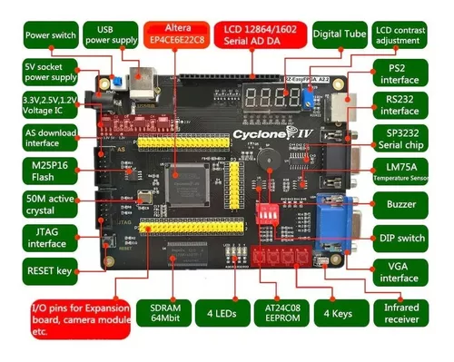
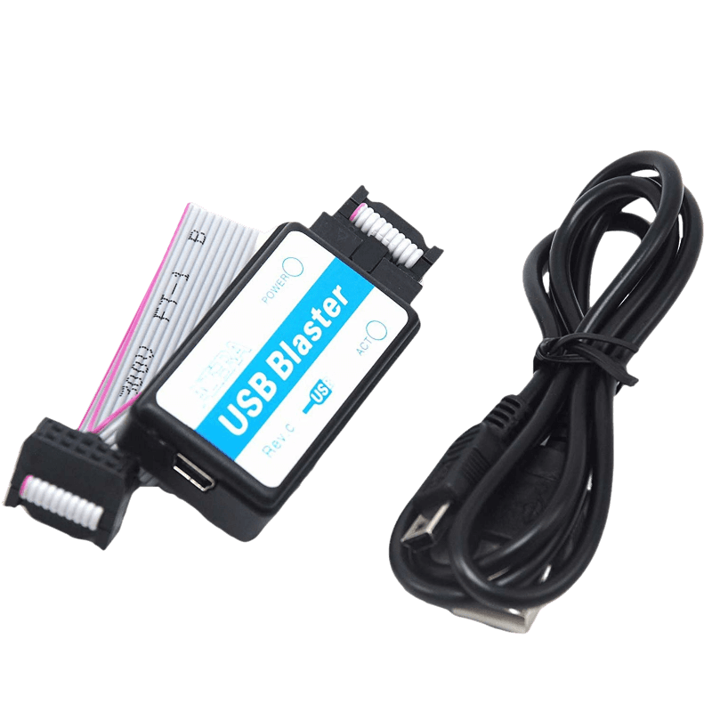

# EP4CE6E22C8 Workbook - VHDL Development with Quartus Prime Lite IDE

Welcome to the EP4CE6E22C8 Workbook GitHub repository! This repository serves as a comprehensive guide and resource for developing projects using the Altera Cyclone IV EP4CE6E22C8 FPGA board with VHDL language and Quartus Prime Lite IDE.

## About the EP4CE6E22C8 Workbook

The EP4CE6E22C8 Workbook is designed to help FPGA enthusiasts, students, and engineers get started with FPGA development using the Altera Cyclone IV EP4CE6E22C8 FPGA board. It provides step-by-step tutorials, example projects, and documentation to facilitate the learning and understanding of FPGA design with VHDL (VHSIC Hardware Description Language) and Quartus Prime Lite IDE, which is a powerful software tool provided by Intel (formerly Altera) for FPGA development.

## Features

- **VHDL Projects:** The repository contains a collection of VHDL-based projects for the EP4CE6E22C8 FPGA board, covering various applications and functionalities.

- **Quartus Prime Lite IDE:** We focus on using the Quartus Prime Lite IDE, which is a free version of the Quartus Prime software suite, to provide an accessible and powerful development environment.

- **Step-by-Step Tutorials:** Each project comes with detailed step-by-step tutorials and explanations to help you understand the design concepts and implementation.

- **Documentation:** The repository includes comprehensive documentation on FPGA basics, VHDL syntax, Quartus Prime Lite tools, and board-specific information.

## Getting Started

To get started with the EP4CE6E22C8 Workbook and start developing FPGA projects, follow these steps:

1. **Clone the Repository:** Start by cloning this GitHub repository to your local machine using the following command:

   ```
   git clone https://github.com/your-username/EP4CE6E22C8-Workbook.git
   ```

   Replace `your-username` with your GitHub username.

2. **Install Quartus Prime Lite IDE:** If you haven't already, download and install Quartus Prime Lite IDE from the Intel (formerly Altera) website.

3. **Explore the Projects:** Browse through the repository's project directories to find the examples and tutorials that interest you.

4. **Follow the Tutorials:** Open the tutorials and follow the step-by-step instructions to understand and implement the projects.

5. **Experiment and Learn:** Once you've completed the tutorials, feel free to experiment with the projects and make modifications to deepen your understanding of FPGA development.

## EVK Board


1. **Power Switch:** The power switch is used to turn the board's power on or off.

2. **5V Socket Power Supply:** This is the input socket for the 5V power supply, which provides the main power source for the board.

3. **Voltage Regulator IC (3.3V, 2.5V, 1.2V):** The voltage regulator IC ensures that the board receives stable and regulated voltages of 3.3V, 2.5V, and 1.2V for various components and peripherals.

4. **AS Download Interface:** The AS Download interface is used for programming the FPGA with the configuration data.

5. **M25P16 Flash:** The M25P16 Flash is a serial NOR Flash memory used for storing non-volatile data or program code.

6. **50MHz Active Crystal:** The 50MHz active crystal provides a stable clock source for the FPGA and other components on the board.

7. **JTAG Interface:** The JTAG interface allows for debugging and programming of the FPGA using Joint Test Action Group (JTAG) protocols.

8. **RESET Key:** The RESET key is a push-button used to reset the FPGA and other components on the board.

9. **USB Power Supply:** The USB power supply provides power to the board through a USB connection.

10. **I/O Pins for Expansion Board, Camera Module, etc.:** These I/O pins allow for connecting and interfacing with various external peripherals, such as expansion boards and camera modules.

11. **Altera EP4CE6E22C8:** The Altera EP4CE6E22C8 is the FPGA chip used on the board, providing programmable logic and processing capabilities.

12. **SDRAM 64Mbit:** The SDRAM provides volatile memory for data storage and processing.

13. **LCD 12864/1602 Serial AD DA:** The LCD 12864/1602 module is used for displaying textual and graphical information and may support analog-to-digital (AD) and digital-to-analog (DA) conversion.

14. **4 LEDs:** These LEDs are used for visual feedback and debugging purposes.

15. **AT24C08 EEPROM:** The AT24C08 is an Electrically Erasable Programmable Read-Only Memory (EEPROM) used for storing small amounts of non-volatile data.

16. **4 Keys:** These keys provide user input and can be used for various interactive applications.

17. **PS2 Interface:** The PS2 interface allows for connecting PS2 peripherals, such as keyboards or mice.

18. **RS232 Interface:** The RS232 interface enables serial communication with external devices.

19. **SP3232 Serial Chip:** The SP3232 is a serial communication IC used for level shifting and signal conversion.

20. **LM75A Temperature Sensor:** The LM75A is a temperature sensor used to measure the board's temperature.

21. **Buzzer:** The buzzer can produce audio signals for audible feedback.

22. **DIP Switch:** The DIP switch is used to configure the board's settings or modes.

23. **VGA Interface:** The VGA interface enables video output to VGA-compatible displays.

24. **Infrared Receiver:** The infrared receiver allows the board to receive infrared signals from remote controls or other devices.

## Altera Blaster:



Altera Blaster is a programming and debugging hardware interface used with Altera FPGA development boards. It facilitates communication between the development computer and the FPGA on the board, enabling configuration programming, real-time debugging, and device testing. The Blaster is responsible for transferring configuration data and facilitating the exchange of debugging information. It stands for a fast and efficient method for managing FPGA development and testing processes, streamlining the development workflow.

## Contributions and Support

I encourage contributions from the community to enhance the EP4CE6E22C8 Workbook and make it more valuable for FPGA enthusiasts. If you have ideas for new projects, improvements, or bug fixes, please feel free to submit a pull request.

If you encounter any issues, have questions, or need support with the EP4CE6E22C8 Workbook, don't hesitate to open an issue in the repository. I'll do my best to assist you.

Let's embark on an exciting journey of FPGA development! Happy coding! 🚀